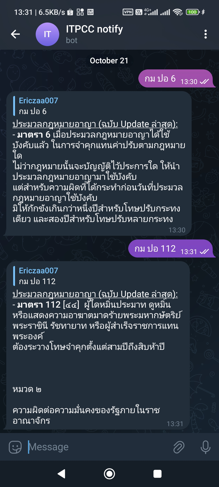

# Telegram bot for search Thai Act article

## What?

It's a Telegram bot for search Thai Act article using a text from Krisdika. For quick and crude to search the law.

## How?

0. Install [Bun](https://bun.sh)
1. Create a Telegram bot using [Botfather](https://telegram.me/BotFather)
2. Rename (`sample.env`)[./.sample.env) to `.env` and change the value in the file
3. `bun run index.ts`

## Where?

The text is direcctly fetched from [Krisdika](https://krisdika.go.th/). The database and the source URL is complied by [PyThaiNLP](https://github.com/PyThaiNLP/thai-law).

## Help?

You may open an issue and PR if you want.

## [License](./LICENSE)

## Disclaimer

This project is intended for personal-use only. Use at your own risk
